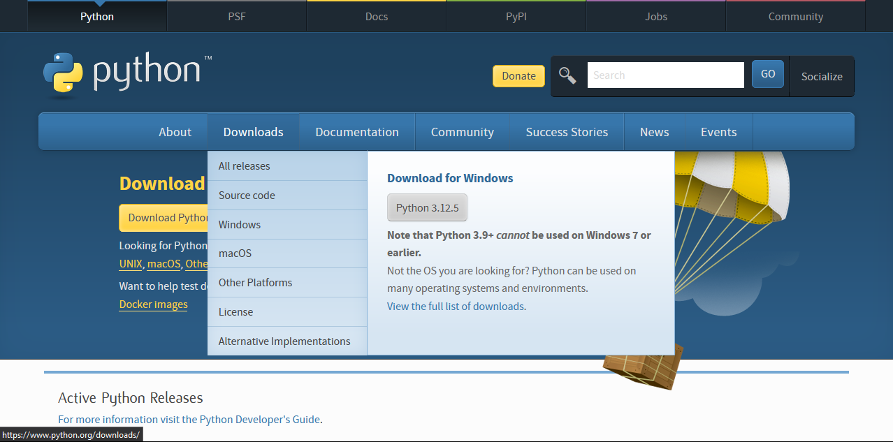
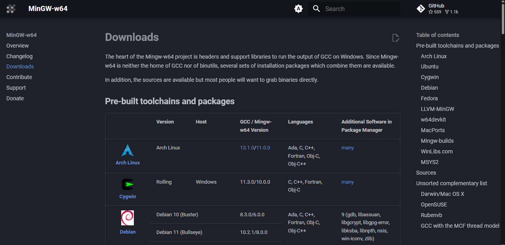
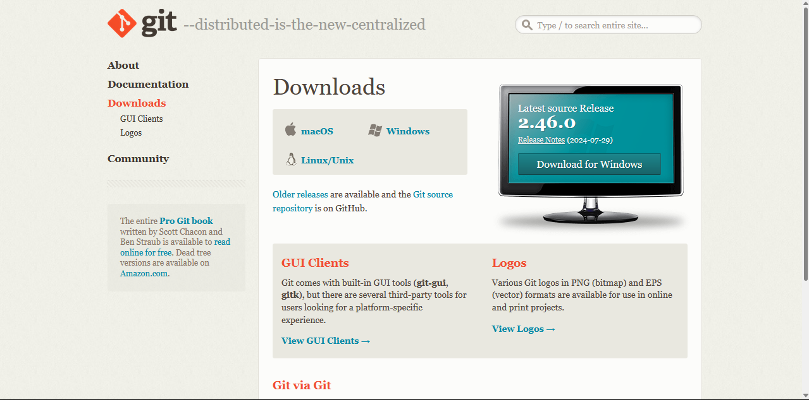
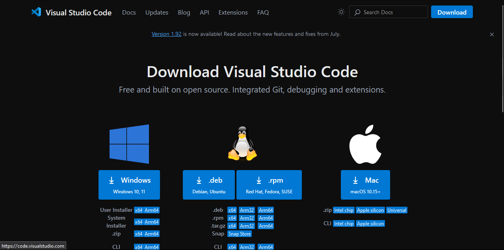
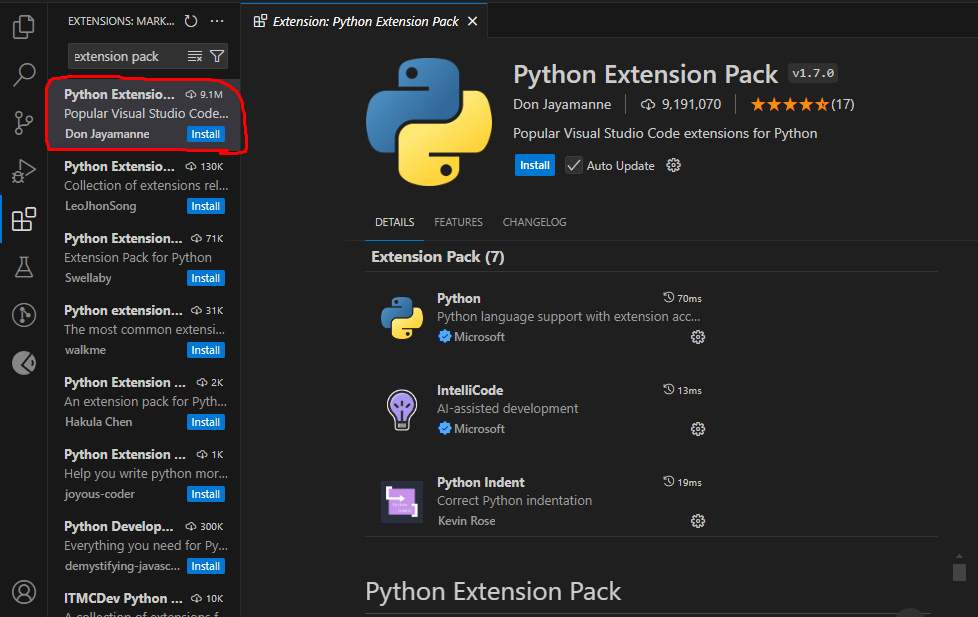
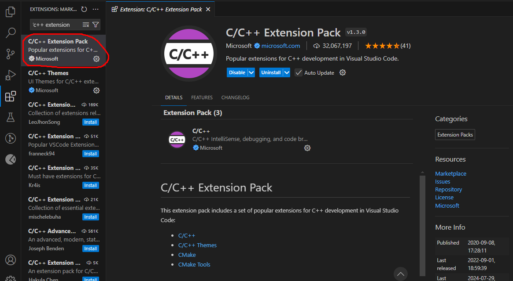

| Materia | Alumno |
| ---------- | ---------- |
| Desarrollo de Software en Sistemas Distribuidos   | Cristian Ovejero   |

### ___Requisitos necesarios para realizar pruebas en el trabajo practico___:
1. Descargar e instalar Python:

[Link de descarga de Python](https://www.python.org/downloads/)
2. Descargar e instalar MinGW:

[Link de descarga de MinGW](https://www.mingw-w64.org/downloads/)
3. Descargar e instalar Git:

[Link de descarga de Git](https://git-scm.com/downloads)
4. Descargar e instalar Visual Studio Code:

[Link de descarga de Visual Studio Code](https://code.visualstudio.com/download)
5. Instalar los siguientes paquetes de extensiones en Visual Studio Code:
* Python Extension Pack (Don Jayamanne):

* C/C++ Extension Pack (Microsoft):

### ___Links adicionales___:
1. [Estrategia de resolucion del trabajo practico](https://drive.google.com/drive/folders/1QXDNYs5_3UzR48Q8YUFM7M6KVptiZl8m?usp=sharing)
2. [Video con pruebas realizadas](https://drive.google.com/drive/folders/1QXDNYs5_3UzR48Q8YUFM7M6KVptiZl8m?usp=sharing)
3. [Pruebas realizadas con capturas de pantalla](https://drive.google.com/drive/folders/1QXDNYs5_3UzR48Q8YUFM7M6KVptiZl8m?usp=sharing)